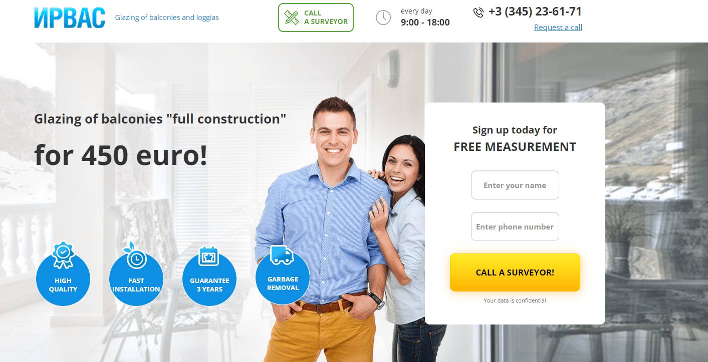

# Windows glazing on-line shop Js App
Windows glazing on-line shop 




### Built With

* [![Javascript][Javascript.io]][Javascript-url]
* [![NodeJs][NodeJs.io]][NodeJs-url]

## Pre-installations

#### Npm install:

  ```sh
  npm install npm@latest -g
  ```
```sh
npm install react-scripts --save
```

#### Reactstrap install:

  ```sh
  npm install reactstrap bootstrap
  ```

#### Clone the repo:

```sh
git clone https://github.com/AdeleDev/shop_app_js.git
```

## Usage

#### Build:
The build artifacts will be stored in the `build` directory.

``` sh
npm run build
```

#### Generate new component:
You can also use `ng generate directive|pipe|service|class|guard|interface|enum|module`.

```sh
ng generate component component-name
```

#### Development server:
Navigate to `http://localhost:4000/

```sh
gulp
```


<!-- MARKDOWN LINKS & IMAGES -->

[Javascript.io]: https://img.shields.io/badge/-Javascript-lightyellow?style=for-the-badge&logo=javascript

[Javascript-url]: https://www.javascript.com/

[NodeJs.io]: https://img.shields.io/badge/-Node.js-green?style=for-the-badge&logo=Node.js

[NodeJs-url]: https://nodejs.org/en/
